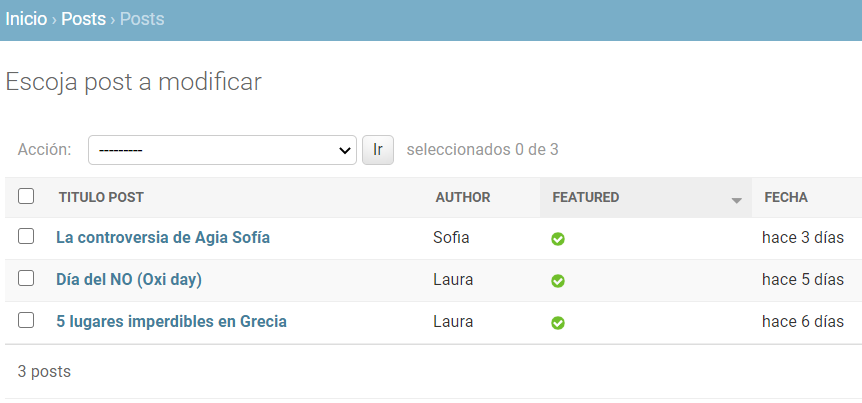
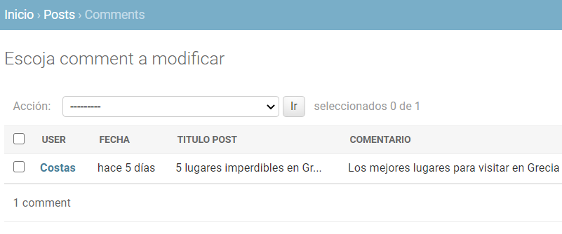

=============================================================
El admin/ de `Xenios <https://asohelenica.com.co>`_
=============================================================
El admin/ es el panel de administración del sitio.

.. contents::

.. |br| raw:: html

    

.. _entrar-al-admin:

Ingreso al admin
-----------------------------------------
Al admin/ pueden ingresar los **superusuarios** con sus credenciales.

Principales aplicaciones del sitio
""""""""""""""""""""""""""""""""""""""""""""""""
Entrando al admin/ se encuentran las tablas de las bases de datos agrupadas por aplicación.
|br| Las aplicaciones más importantes son:

* **POSTS**: Aplicación principal. La mayoría de sus tablas se usan frecuentemente.
* **AUTENTICACIÓN Y AUTORIZACIÓN**: La tabla Usuarios contiene los registros de los usuarios registrados.
* **CUENTAS**: La tabla correos electrónicos de los usuarios registrados.
* **NEWSLETTER**: Para envío de correos masivos a usuarios suscritos en nuestro boletín de noticias.

Existen algunas aplicaciones y algunas tablas que son auxiliares y aunque se pueden visualizar no se debería trabajar con ellas en condiciones normales.

.. figure:: _static/img/meander.png
   :align: center     
   :alt: meander   

.. rst-class:: clear-both

|br|

.. _admin-app-posts:

La aplicación Posts y sus tablas
------------------------------------------------
Es la aplicación principal para la administración de los posts.
|br| Sus principales tablas son:

* **Posts**: Contiene los post del **Blog**. Se pueden crear nuevos y modificar el contenido de posts existentes.
* **Eventos**: Contiene los post para Eventos y Programas. Aquí se puede crear o modificar contenido para los Eventos.
* **Tramites**: Contiene registros para Representaciones consulares y embajadas. Para su correcta visualización, los registros se deben clasificar por categoría: en Grecia, en Colombia y Otros.
* **Otro Enlaces**: Contiene registros para el site Información / Trámites para la sección: Otros enlaces que principalmente son ministerios en Colombia, en Grecia y Otros.
* **Culturas**: Enlaces de Cultura y Turismo. Aquí se deben agregar los registros a mostrar por categoría:

   * Qué hacer en Grecia
   * Qué hacer en Colombia
   * Otros

En las tablas se cuenta con una variable tipo boolean para controlar si el registro se debe mostrar o no en la página.
|br| En **Posts** con **featured**.
|br| En **Eventos**, **Tramites**, **Otro Enlaces** y **Culturas** con **activo**.

.. figure:: _static/img/meander.png
   :align: center     
   :alt: meander   

.. rst-class:: clear-both

|br|

.. _admin-posts:

La tabla Posts
------------------------------------------------
En la siguiente imagen la vista general de la tabla **Posts**, en la cual se visualiza el título del post, author, featured y días desde (timesince).

   
   Vista general de la tabla **Posts**

|br|

Con click sobre el título de la columna se activan filtros.
|br| A seleccionar uno o más registros se podrán aplican las acciones de la lista desplegable **Acción** y luego click en **Ir**
|br| Esta forma de procesar algunas acciones es común en todas las tablas del admin/
|br| En **Posts** como en otras tablas se relacionan **filtros** a mano derecha de la página, los cuales permiten una vista rápida clasificada por los argumentos que se usan en los filtros aplicados. Se pueden aplicar varios **filtros** a la vez, con un solo click sobre ellos.

.. figure:: _static/img/meander.png
   :align: center     
   :alt: meander   

.. rst-class:: clear-both

|br|

.. _admin-esporadicas:

Tablas de uso esporádico en Posts
------------------------------------------------
La aplicación Posts incluye una serie de tablas cuyo uso no será muy frecuente.
|br| Estas se requieren sólo para cambios estructurales. 
|br| Se recomienda que las maneje sólo el administrador.

Estas tablas son:

* **Aliados**: Contiene los registros para la sección de Aliados en la página Acerca de Nosotros.
* **Authors**: Contiene los registros de los autores de posts.
* **Categorys**: Contiene los registros de las categorías que agrupan los posts del Blog.
* **Comites**: Contiene los registros de los comité y su objeto. Se muestran en la página Acerca de Nosotros.
* **Fotos**: Contiene los archivos de fotos dinámicas. Se deben usar sin modificar los slug creados (el slug es el código que permite al programa encontrar la imagen).
* **Textos**: Contiene los textos dinámicas. Se deben usar sin modificar los slug creados, igual que en **Fotos**.
* **Members**: Contiene los registros de los miembros de la asociación, su nombre, foto y cargo. Sólo se muestran members con Activo = True. Se muestran en la página Acerca de Nosotros.

.. figure:: _static/img/meander.png
   :align: center     
   :alt: meander   

.. rst-class:: clear-both

|br|

.. _admin-donacion:

Tablas relacionadas con las Causas en Donaciones
-------------------------------------------------
Algunas tablas de la aplicación Posts están destinadas a la estructura de las **Causas** de Donaciones.
|br| Estas son:

* **Causas**: Contiene los registros de las causas, para la página Donaciones. Los campos de **Causas** incluyen el título, overview, imagen, video, link, contenido, palabras claves, valor recaudado y valor meta entre otros (es un contenido parecido a un post del blog). Sólo se muestran causas con **Activo** = True
* **Impacto causas**: Contiene los registros de los impactos generales de la administración de las causas y sus valores. Sus datos se muestran en la página Donaciones. Sólo se muestran impactos con **Activo** = True.
* **Comment causas**: Contiene los comentarios de los usuarios sobre las diferentes causas.

.. figure:: _static/img/meander.png
   :align: center     
   :alt: meander   

.. rst-class:: clear-both

|br|

.. _admin-auxiliares:

Otras tablas auxiliares de la aplicación Posts
-------------------------------------------------
Las tablas relacionadas aquí no requieren interacción para crear nuevos registros, modificaciones o eliminaciones por parte del administrador o staff.
|br| Son tablas que acumulan información ingresada por los usuarios y sirven para análisis de datos y revisión en caso de precisar algún dato en la comunicación y retroalimentación con el usuario.
|br| Estas tablas son:

* **Comments**: Contiene los registros de los comentarios realizados por los usuarios a los posts del blog.
* **Contactss**: Contiene los registros de los contactos que han enviado mensajes a la asociación.
* **Inscriptions**: Contiene los registros de las inscripciones de los usuarios a los eventos.
* **Profiles**: Contiene los datos personales de los usuarios registrados.
* **Recommends**: Contiene las recomendaciones que los usuarios escriben cuando visualizan el detalle de un post interno de **Cultura y Turismo** sobre una página externa recomendada. Esta opción está actualmente desactivada y sólo se muestra un link a la página externa. No existen links para esas páginas tipo post pero se podrían activar a futuro.
* **Post views**: Tabla que lleva registro de los usuarios que visualizan posts del blog.
* **Cultura views**: Tabla que lleva registro de los usuarios que visualizan posts de tipo **Cultura**.
 

.. _admin-comments:

La tabla Comments
------------------------------------------------
Entrando a la tabla **Comments** se visualizan:

* **User**: El nombre del usuario que hace el comentario
* **Fecha**: Número de días desde que se hizo el comentario (timesince)
* **Título Post**: El título del post al cual se hizo el comentario por parte del usuario, truncado.
* **Comentario**: El texto del comentario truncado.

   Vista general de la tabla **Comments**

.. rst-class:: clear-both

|br| 

Los comentarios se pueden eliminar como los demás registros de las tablas, seleccionándolos y usando la acción Eliminar.

|br| Desarrollo: `foQus Software <https://foqus.herokuapp.com/>`_

