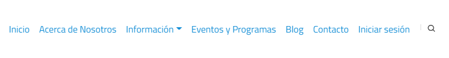
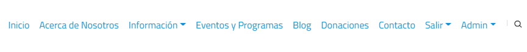
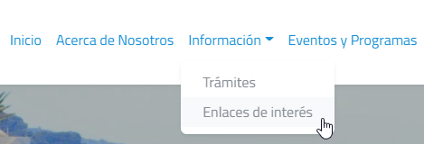
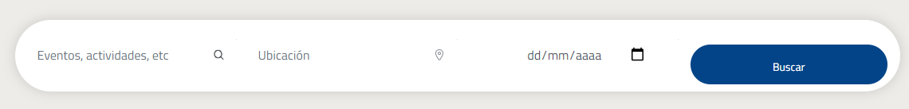
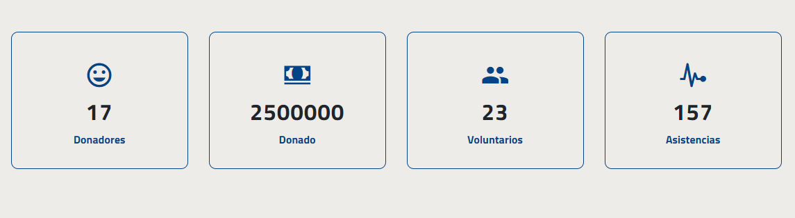
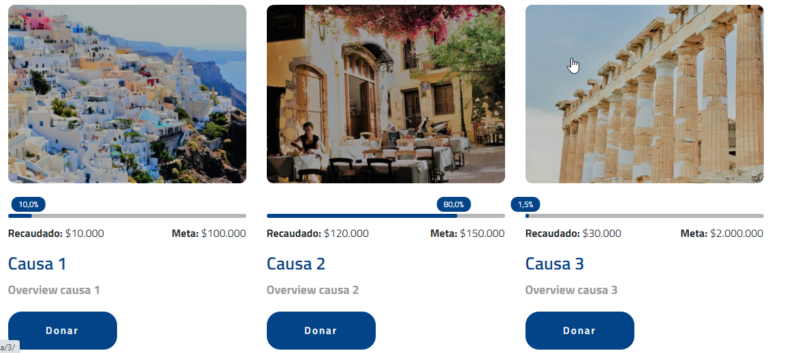
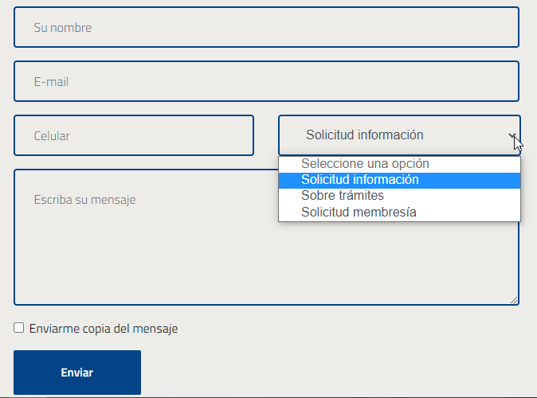
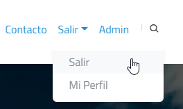
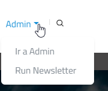

=============================================================
Menu de `asohelenica.com.co <https://asohelenica.com.co>`_
=============================================================
El menú de Xenios permite iniciar sesión y acceder a opciones destinadas al superusuario.

.. contents::

.. |br| raw:: html

    

.. figure:: _static/img/meander.png
   :align: center     
   :alt: meander   

.. rst-class:: clear-both

|br|

.. _menu-principal:

Menu principal visible por el superusuario
--------------------------------------------

   Menu visto por un usuario común

Antes de ingresar e identificarse el menu se muestra como en la imagen anterior.
|br| Cuando un usuario **inicia sesión**, si es superusuario verá el menú que se ve a continuación.
|br| Este menu habilita algunas opciones destinadas a los administradores de la página.

   Menu visto por el superusuario

El menú con todas sus opciones habilitadas se compone por los siguientes elementos:

* :ref:`inicio`
* :ref:`sobrenosostros`
* :ref:`informacion`

   * :ref:`tramites`
   * :ref:`enlaces-interes`
   
* :ref:`eventos-programas`
* :ref:`blog`
* :ref:`donaciones`
* :ref:`contacto`
* :ref:`salir`

   * :ref:`salir`
   * :ref:`mi-perfil`
   
* :ref:`admin`

   * :ref:`ir-a-admin`
   * :ref:`run-newsletter`
   * :ref:`readthedocs`

* :ref:`busqueda`

.. figure:: _static/img/meander.png
   :align: center     
   :alt: meander   

.. rst-class:: clear-both

|br|

.. _inicio:

Inicio
------------------------------------------------
Es la página **home** para el sitio.

Imágen del fondo
""""""""""""""""""""""""""""""""""""""""""""""""
Imágen estática: img/foto-header2.jpeg
|br| Se puede actualizar subiendo una nueva imágen en static/img pero manteniendo el mismo nombre.

Próximos eventos y programas
""""""""""""""""""""""""""""""""""""""""""""""""
Muestra los tres últimos eventos (tabla Eventos) indexados por fecha.

Últimos posts
""""""""""""""""""""""""""""""""""""""""""""""""
Muestra los tres últimos posts (tabla Posts) indexados por fecha.

Sección regístrese
""""""""""""""""""""""""""""""""""""""""""""""""
Cuando el usuario no está autenticado se muestra un link a **Regístrese en Xenios**
|br| Cuando está autenticado se muetsra link a **Suscríbase a nuestro boletín**

Comuníquese con nosotros
""""""""""""""""""""""""""""""""""""""""""""""""
Datos generales de la asociacíón. Son estáticos. Su modificación deberá hacerse en index.html
|br| Incluye botón: **Contáctenos**
|br| Incluye plugin de **Facebook** con contenido de la página facebook de asohelénica.

En Instagram @asohelenica
""""""""""""""""""""""""""""""""""""""""""""""""
8 fotos estáticas del instagram con nombres:
img/instagram/instagram-1.jpg
instagram-2.jpg, instagram-3.jpg, instagram-4.jpg, instagram-5.jpg, instagram-6.jpg, instagram-7.jpg, instagram-8.jpg
|br| Para modificarlas se deberán copiar las nuevas imágenes en static/ folder, manteniendo los mismos nombres que se referencian aquí.
|br| El tamaño de esas imágenes es de 160 x 160 px

.. figure:: _static/img/meander.png
   :align: center     
   :alt: meander   

.. rst-class:: clear-both

|br|

.. _sobrenosostros:

Acerca de nosotros
------------------------------------------------

Imágen del fondo
""""""""""""""""""""""""""""""""""""""""""""""""
Imágen estática: img/grecia3.jpeg
|br| Se puede actualizar subiendo una nueva imágen en static/img pero manteniendo el mismo nombre.

Foto dinámica
""""""""""""""""""""""""""""""""""""""""""""""""
La foto que acompaña el texto es dinámica. Se puede modificar en la tabla **Fotos**. Se identifica con el slug **aboutusprincipal**

Textos estáticos
""""""""""""""""""""""""""""""""""""""""""""""""
Los textos son estáticos tanto para el párafo titulado: 
|br| ¿Qué es la Asociación Helénica de Colombia?
|br| Como para el párafo: ¿Qué hacemos?
Son modificables editando el archivo: aboutus.html

Sección Miembros
""""""""""""""""""""""""""""""""""""""""""""""""
Contenido dinámico de la tabla **Members** con campos nombre, cargo, image, fundador, entre otros.

Sección Comité
""""""""""""""""""""""""""""""""""""""""""""""""
Contenido dinámico de la tabla **Comites** con campos nombre, objeto, activo entre otros. Tiene disponible campo para imagen.

Sección Nuestros Estatutos
""""""""""""""""""""""""""""""""""""""""""""""""
Se muestra un input para capturar el email del usuario interesado en los estatutos, si está autenticado.
|br| El site envía un email a info@asohelenica.com.co informando que el usuario requiere los estatutos.
|br| Si el usuario no está autenticado no ve este link.

.. figure:: _static/img/meander.png
   :align: center     
   :alt: meander   

.. rst-class:: clear-both

|br|

.. _informacion:

Información
------------------------------------------------

   Lista desplegable para el menú Información

.. rst-class:: clear-both

|br|

.. _tramites:

Trámites
------------------------------------------------

Imágen del fondo
""""""""""""""""""""""""""""""""""""""""""""""""
Imágen estática: img/grecia1.jpeg
|br| Se puede actualizar subiendo una nueva imágen en static/img pero manteniendo el mismo nombre.

Sección Representación de Grecia en Colombia
""""""""""""""""""""""""""""""""""""""""""""""""
El contenido es dinámico desde la tabla **Tramites**, con filtro para categoría = "en Colombia".

Sección Representación de Colombia en Grecia
""""""""""""""""""""""""""""""""""""""""""""""""
El contenido es dinámico desde la tabla **Tramites**, con filtro para categoría = "en Grecia".

Sección Otros enlaces
""""""""""""""""""""""""""""""""""""""""""""""""
El contenido es dinámico desde dos tablas: **Tramites** y **Otro Enlaces**
|br| Desde **Tramites** con filtro para categoría = "Otros" y desde **Otro Enlaces** para las tres categorías: "en Colombia", "en Grecia" y "Otros".

Fotos dinámicas de las secciones
""""""""""""""""""""""""""""""""""""""""""""""""
Fotos dinámicas, en tabla **Fotos** con slug:
|br| **tramitesengrecia**: si no existe se usará la estática img/procedure1.jpeg 
|br| **tramitesencolombia**: si no existe se usará la estática img/procedure2.jpeg
|br| **tramitesotros**: si no existe se usará la estática img/procedure3.jpeg

.. _enlaces-interes:

Enlaces de interés
------------------------------------------------

Imágen del fondo
""""""""""""""""""""""""""""""""""""""""""""""""
Imágen estática: img/grecia1.jpeg
|br| Se puede actualizar subiendo una nueva imágen en static/img pero manteniendo el mismo nombre.

Sección qué hacer
""""""""""""""""""""""""""""""""""""""""""""""""
Se compone por tres botones:

*  Botón qué hacer en Grecia.
   |br| Contenido dinámico de la tabla **Culturas** para categoría= "Grecia"

*  Botón qué hacer en Colombia.
   |br| Contenido dinámico de la tabla **Culturas** para categoría= "Colombia"

*  Botón Rincones griegos en Colombia.
   |br| Contenido dinámico de la tabla **Culturas** para categoría= "Rincones"

La estructura de las bases de datos incluye un link a post interno para cada sitio externo.
|br| Estos post se pueden crear en la tabla **Culturas** que incluye varios campos: nombre, overview, 3 images, link externo, categoría, contenido, entre otros, para una página de detail completa.

Carousel con 4 fotos
""""""""""""""""""""""""""""""""""""""""""""""""
Contenido dinámico desde la tabla **Fotos** con slug:

*  culturecarrousel1
*  culturecarrousel2
*  culturecarrousel3
*  culturecarrousel4

.. figure:: _static/img/meander.png
   :align: center     
   :alt: meander   

.. rst-class:: clear-both

|br|

.. _eventos-programas:

Eventos y Programas
------------------------------------------------

Imágen del fondo
""""""""""""""""""""""""""""""""""""""""""""""""
Imágen estática: img/grecia1.jpeg
|br| Se puede actualizar subiendo una nueva imágen en static/img pero manteniendo el mismo nombre.

Formulario de búsqueda
""""""""""""""""""""""""""""""""""""""""""""""""

   Formulario de búsqueda de eventos

.. rst-class:: clear-both

|br|
El Formulario permite la búsqueda por texto, ubicación o fecha del evento

Sección eventos
""""""""""""""""""""""""""""""""""""""""""""""""
Relación paginada de eventos indexados por fecha con link al detail de los mismos.

Galería
""""""""""""""""""""""""""""""""""""""""""""""""
Galería con 8 fotos dinámicas de la tabla **Fotos** con slug:
|br| eventsgallery1, eventsgallery2, eventsgallery3, eventsgallery4, eventsgallery5, eventsgallery6, eventsgallery7, eventsgallery8

.. figure:: _static/img/meander.png
   :align: center     
   :alt: meander   

.. rst-class:: clear-both

|br|

.. _blog:

Blog
------------------------------------------------

Imágen del fondo
""""""""""""""""""""""""""""""""""""""""""""""""
Imágen estática: img/grecia4.jpeg
|br| Se puede actualizar subiendo una nueva imágen en static/img pero manteniendo el mismo nombre.

Sección posts
""""""""""""""""""""""""""""""""""""""""""""""""
Relación paginada de posts del blog indexados por fecha con link al detail.
|br| Se relacionan los campos: título (title), autor (author), sus categorías (categories), antigüedad del post (timestamp), imagen principal y el overview (truncado a 270 caracteres)

Sidebar 
""""""""""""""""""""""""""""""""""""""""""""""""
Se compone por varias secciones:

* Un texto Acerca de nosotros
* Input para Búsqueda
* 3 Últimas publicaciones

Las **Categorías** son una relación dinámica de las categorías de los post con link a un filtro de posts por categoría.
|br| Usa el sidebarblog.html

Sidebar: Acerca de nosotros
""""""""""""""""""""""""""""""""""""""""""""""""
Este texto es dinámico desde la tabla **Textos** con slug = **aboutusoverview**
|br| Si no existe se muestra como texto estático:
|br| "Somos una organización creada para fortalecer la comunidad Griega en Colombia y asegurar la preservación de nuestro legado."

Sidebar: Búsqueda
""""""""""""""""""""""""""""""""""""""""""""""""
Esta búsqueda se limita a la tabla **Posts** y usa los campos:
|br| title, overview, content, pclaves, categories (title) y author

Sidebar: Últimas publicaciones
""""""""""""""""""""""""""""""""""""""""""""""""
Se relacionan los tres últimos posts indexados por fecha más reciente.

Las categorias de los posts:
""""""""""""""""""""""""""""""""""""""""""""""""
Las categorías se pueden crear por el autor del post y se manejan en la tabla **Categorys**
|br| Actualmente están creadas: Religión, Historia, Cultura, Turismo
|br| Se pueden crear todas las que se requieran.
|br| Un post puede pertenecer a más de una categoría.
|br| Al cambiar el título (campo title) de una categoría todos los posts que le pertenecen reflejarán el cambio.

.. figure:: _static/img/meander.png
   :align: center     
   :alt: meander   

.. rst-class:: clear-both

|br|

.. _donaciones:

Donaciones
------------------------------------------------

Imágen del fondo
""""""""""""""""""""""""""""""""""""""""""""""""
Imágen estática: img/grecia7.jpeg
|br| Se puede actualizar subiendo una nueva imágen en static/img pero manteniendo el mismo nombre.

Sección: ¿Qué queremos lograr?
""""""""""""""""""""""""""""""""""""""""""""""""
Texto dinámico desde la tabla **Textos** con slug = **donationquelograr**
|br| Si no existe el registro se muestra: "Queremos generar nuevo bienestar para la comunidad griega en Colombia."

Frame de video
""""""""""""""""""""""""""""""""""""""""""""""""
Dirección estática, actualmente un video de muestra.

Sección Nuestras Causas
""""""""""""""""""""""""""""""""""""""""""""""""
El título es estático: Nuestras causas
|br| El subtítulo es dinámico desde la tabla **Textos** con slug = **donationcausassubtit**
|br| Si no existe el registro se muestra: "Nuestros proyectos están enfocados al bienestar de la comunidad griega en Colombia."

Sección Nuestras Causas
""""""""""""""""""""""""""""""""""""""""""""""""
Se relacionan todas las causas paginadas, con link al detalle, título de la causa, su overview, valor recaudado, valor meta, el % de cumplimiento de la meta y un botón llamado **Donar** con link al detail.

Sección cifras
""""""""""""""""""""""""""""""""""""""""""""""""
Contenido dinámico desde la tabla **Impacto causas**, se leen los primeros cuatro indexados por fecha. 
|br| En la imagen de ejemplo (a continuación) se han creado:

* Donadores con valor 17
* Donado con valor $2500.000
* Voluntarios con valor 23
* Asistencias con valor 157

   Ejemplo de cifras para donaciones.

.. rst-class:: clear-both

|br|

Sección Quiere ser voluntario?
""""""""""""""""""""""""""""""""""""""""""""""""
El título es estático: ¿Quiere ser voluntario?
|br| El subtítulo es dinámico desde la tabla **Textos** con slug = **donationvolunteer**
|br| Si no existe el registro se muestra: "Si quiere apoyar alguna de nuestras causas puede ser voluntario. No dude en contactarnos."

Sección: ¿Quiere ser voluntario? Contáctenos
""""""""""""""""""""""""""""""""""""""""""""""""
La sección incluye un botón con link a la página contacto.

A continuación una imágen de la página **Donaciones** con relación de las causas, sus datos principales y link al detalle de la causa.

   Ejemplo de causas con sus cifras en la página **Donaciones**

.. rst-class:: clear-both

|br|

.. figure:: _static/img/meander.png
   :align: center     
   :alt: meander   

.. rst-class:: clear-both

|br|

.. _contacto:

Contacto
------------------------------------------------

Imágen del fondo
""""""""""""""""""""""""""""""""""""""""""""""""
Imágen estática: img/grecia7.jpeg
|br| Se puede actualizar subiendo una nueva imágen en static/img pero manteniendo el mismo nombre.
|br| El divider es una imagen estática como división de las secciones: img/foto-header2.jpeg

Sección ¿Quiere ser miembro de Asohelénica?
""""""""""""""""""""""""""""""""""""""""""""""""
Título estático: "Ser miembro es fácil. Envíenos su solicitud y estaremos en contacto."
|br| Imagen estática: img/demo-1.jpeg
|br| Formulario: Incluye los campos: nombre, e-mail, celular, ¿Porqué quiere ser miembro?
|br| Permite la opción de enviar copia del mensaje al email del usuario y envía la solicitud al email info@asohelenica.com.co
|br| Los datos ingresados se guardan en la tabla **Contacts**

Seccion: Comuníquese con nosotros
""""""""""""""""""""""""""""""""""""""""""""""""
El subtítulo es estático: "Nos puede enviar sus datos por email o llamarnos al número telefónico relacionado."
|br| Se modifica en contact.html
|br| Izquierda: datos estáticos de la asociación. Para cambiarlos se debe modificar el archivo contact.html
|br| Derecha: Formulario: Incluye los campos: nombre, e-mail, celular, Lista desplegable de temas y campo para texto de mensaje.
|br| Permite la opción de enviar copia del mensaje al email del usuario y envía el mensaje al email info@asohelenica.com.co
|br| Los datos ingresados se guardan en la tabla **Contacts**

A continuación una imágen del formulario: Comuníquese con nosotros

   El formulario "Comuníquese con nosotros"

.. rst-class:: clear-both

|br| Los temas de la lista desplegable se pueden modificar, cambiar su orden o agregar más, en contact.html
|br| Actualmente se incluyen:

* Solicitud información
* Sobre trámites
* Solicitud membresía

El tema seleccionado por el usuario se guarda en la tabla **Contacts** y se envía por e-mail.

El e-mail contiene los datos del usuario, la fecha de comunicación, el mensaje de texto y el título que es el mismo tema seleccionado por el usuario desde la lista desplegable.
|br| Se relaciona el número de registro en la tabla **Contacts** para poder ubicarlo con mayor facilidad. 

.. figure:: _static/img/meander.png
   :align: center     
   :alt: meander   

.. rst-class:: clear-both

|br|

.. _salir:

Salir
------------------------------------------------
El menú **Salir** incluye dos links: **Salir** y **Mi Perfil**

   Lista deplegable del menú **Salir** con 2 links

.. rst-class:: clear-both

|br| 
Esta opción del menú se muestra si el usuario ha sido autenticado (si ha ingresado previamente al site).
|br| La opción **Salir** direcciona a una página de confirmación con URL: accounts/logout/ y permite al usuario el logout de la página.
|br| La opción **Mi Perfil** direcciona a la URL: /miperfil/

.. _mi-perfil:

Mi Perfil
""""""""""""""""""""""""""""""""""""""""""""""""
En **Mi Perfil** el usuario puede complementar o actualizar sus datos, actualizar su imagen de perfíl y dispone de dos links adicionales:

* Cambiar clave
* Reiniciar su clave (en caso de olvido)

.. figure:: _static/img/meander.png
   :align: center     
   :alt: meander   

.. rst-class:: clear-both

|br|

.. _admin:

Admin
------------------------------------------------
El menú **Admin** incluye dos links: **Ir a Admin** y **Run Newsletter**

   Lista deplegable del menú **Admin** con 2 links

.. rst-class:: clear-both

|br| 

.. _ir-a-admin:

Ir a Admin
""""""""""""""""""""""""""""""""""""""""""""""""
Esta opción del menú **Admin** direcciona a la página del administrador.
|br| Este link se puede ver sólo pos superusuarios.
|br| Si un usuario común digita en el browser la dirección /admin/ sin haber sido autenticado primero, la página lo direcciona al login/ Donde deberá ingresar unas credenciales válidas de superusuario para poder entrar.

.. _run-newsletter:

Run Newsletter
""""""""""""""""""""""""""""""""""""""""""""""""
Con click al link **Run Newsletter** se envían los newsletters pendientes de envío. 
|br| Para mayor detalle sobre la administración de envío de newsletter ver Administración de los newsletters

.. _readthedocs:

ReadTheDocs
""""""""""""""""""""""""""""""""""""""""""""""""
Este link direcciona a la página de ayuda en readthedocs

.. figure:: _static/img/meander.png
   :align: center     
   :alt: meander   

.. rst-class:: clear-both

|br|

.. _busqueda:

Búsqueda
------------------------------------------------
Con click al link de búsqueda (lupa) del menú se direcciona a la página con URL: https://asohelenica.com.co/busqueda/ 

Imágen del fondo
""""""""""""""""""""""""""""""""""""""""""""""""
Imágen estática: img/grecia7.jpeg
|br| Se puede actualizar subiendo una nueva imágen en static/img pero manteniendo el mismo nombre.

Links
""""""""""""""""""""""""""""""""""""""""""""""""
Se relacionan links a la página de inicio (icon home), a Eventos, Blog y Trámites.

Input texto
""""""""""""""""""""""""""""""""""""""""""""""""
El texto se busca en los campos de titulos, overview, contenido y palabras claves de las tablas principales del sitio.
|br| Algunas palabras direccionan directamente al sitio: 

* Event, events, evento, eventos: direccionan a Eventos
* Post, posts, blog: direccionan a Blog
* Tramite, trámite(-s), embajada, consulado: direccionan a Tramites
* Enlaces de interés, enlaces externos, hacer en grecia, hacer en colombia, rincon griego, rincones griegos: direccionan a Cultura
* acerca, nosotros, about us, comité, comités: direccionan a Sobre nosotros

Los resultados se muestran paginados.

