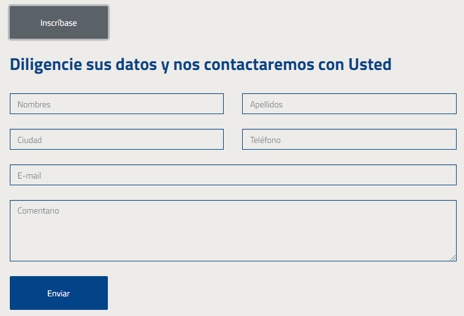

=============================================================
Los Posts en `Xenios <https://asohelenica.com.co>`_
=============================================================

En Xenios existen diferentes tipos de posts, como posts para el **Blog** o para la página de **Eventos**.
|br| La creación de los posts en Xenios se puede hacer únicamente con acceso al admin/. No existe link externo para ese fin.

.. contents::

.. |br| raw:: html

    

   
.. _posts-blog:

Los posts del Blog
-----------------------------------------
Los posts para el **Blog** se visualizarán en la página donde nos lleva el link de menú: **Blog**
|br| Cada post se compone por varios campos. Los más importantes son:

* **Title**: El título del post
* **Overview**: Un pequeño resumen sobre el tema del post. Este se utiliza en las vistas generales de los post y es el primer texto que lee un usuario. Dependiendo del interés que le despierte el tema seguirá leyendo.
* **Content**: Es el contenido principal del artículo. Cuenta con editor que permite insertar fotos, videos, links, etc. El editor permite trabajar en pantalla completa y visualizar el código html.
* **Author**: El nombre del autor del post
* **Thumbnail**: La imágen principal para el post. Con esta imágen se identificará el post en las vistas genéricas y en los sidebars
* **Alt**: Campo de texto alternativo para la imagen thumbnail. Su objeto es mejorar la accesibilidad del sitio.
* **Categories**: Las categorías donde clasificamos el post. Un post puede pertenecer a varias categorías. Al momento de crear un nuevo post se puede crear también una nueva categoría para clasificarlo, si no está disponible.
* **Featured**: Si se marca este checkbox el post se mostrará en la página. Si no está marcado el post existe pero no aparece.
* **Pclaves**: Son las palabras claves que queremos asignar al post. Dependiendo de este campo el post podrá aparecer o no en las búsquedas del usuario.
* **Previous post** y **Next post**: Son dos campos que permiten ordenar los posts de manera que se quieran visualizar.

En la siguiente imágen se aprecia la vista general de un post con algunos de sus elementos:

* Título
* Autor
* Categorías
* Overview
* Dias desde (timesince)

   Vista general de un post. Sus elementos principales.

.. rst-class:: clear-both

|br|

.. rst-class:: clear-both

|br|

.. _post-detail:

El post-detail
------------------------------------------------
Con click al link del post la página nos direcciona al post-detail.

Imágen del fondo
""""""""""""""""""""""""""""""""""""""""""""""""
Imágen estática: img/grecia4.jpeg
|br| Se puede actualizar subiendo una nueva imágen en static/img pero manteniendo el mismo nombre.

Sección post
""""""""""""""""""""""""""""""""""""""""""""""""
Muestra todo el contenido del post, su título, overview, imágen principal y contenido, autor, categorías y antigüedad.
|br| Este contenido puede incluir imágenes, URL de videos, links externos, etc.
|br| En el ejemplo del post: 5 lugares imperdibles en Grecia se incluyen varias fotos.

Seccion Comentarios
""""""""""""""""""""""""""""""""""""""""""""""""
Si el usuario no ha iniciado sesión verá un botón: **Inicie sesión para comentar**
|br| Una vez haya iniciado sesión verá el botón: **Escribir un comentario**
|br| Los comentarios se guardan en la tabla **Comments** y se visulizan en la parte inferior de la página, debajo del contenido del post.

Sidebar en post-detail
""""""""""""""""""""""""""""""""""""""""""""""""
Se compone por varias secciones:

* Un texto Acerca de nosotros
* Input para Búsqueda
* 3 Últimas publicaciones

|br| Las **Categorías** son una relación dinámica de las categorías de los post. Cada **categoría** es un link a un filtro de posts por categoría.
|br| **Compartir** con links para Facebook e Instagram 
|br| Usa el sidebarpostdetail.html

El Sidebar de post-detail es el mismo sidebar de la página del blog.

.. rst-class:: clear-both

|br|

.. _event-detail:

El event-detail
------------------------------------------------
Con click al link de un post de **evento** la página nos direcciona al detalle del mismo.

Imágen del fondo
""""""""""""""""""""""""""""""""""""""""""""""""
Imágen estática: img/grecia2.jpeg
|br| Se puede actualizar subiendo una nueva imágen en static/img pero manteniendo el mismo nombre.

Sección: Post del evento
""""""""""""""""""""""""""""""""""""""""""""""""
Muestra todo el contenido del post, su título, overview, imagen principal y contenido.
|br| Este contenido puede incluir imágenes, URL de videos, links externos, etc.
|br| Su estructura en la base de datos es muy similar al post del blog.

Seccion: Detalles del evento
""""""""""""""""""""""""""""""""""""""""""""""""
Se muestran Fecha, Lugar y Entrada.
|br| Si no existe Lugar, no se muestra. Si existe un link y no existe Lugar, se muestra el link. Esto es útil para los eventos que no se realizan de manera presencial en un lugar sino de manera virtual, como por ej. un webinar.

Sidebar 
""""""""""""""""""""""""""""""""""""""""""""""""
Se compone por varias secciones:

* Un texto Acerca de nosotros
* Otros eventos (3 últimos)
* Compartir con links para Facebook e Instagram 

La siguiente imagen muestra cómo aparece el **link** (activo) cuando el campo lugar (ubicación) no existe y existe un link en el campo **tlink**:

.. figure:: _static/img/event-details1.png
   :align: center
   :scale: 80%
   :class: box-shadow 
   :alt: detalles de un evento

   Elementos en los Detalles de un Evento

.. rst-class:: clear-both

|br|
Con click al botón **Inscríbase** se muestra el formulario de inscripción:

   Formulario para la inscripción a un evento

.. rst-class:: clear-both

|br|
Cuando el usuario se inscribe se guardan los datos en la tabla **Inscriptions**
|br| Y se envía en email a info@asohelenica.com.co informando sobre la inscripción.
|br| El email de inscripción contiene la sgte información:

* Título: Nueva inscripción al evento <nombre de evento>
* Fecha de comunicación: que es la misma de la inscripción del usuario.
* Nombre, E-mail, Tel, Ciudad: Datos ingresados por el usuario que se inscribe.
* Interesado en: Es el nombre del evento desde el cual se inscribe.
* Contenido del mensaje: Es el texto que nos envía el usuario ingresado en el input comentario.
* Id# del registro en Inscription: Con este número de registro se puede ubicar el mismo en la tabla Inscriptions de ser necesario.
* Origen del contacto: Es el nombre del post del evento desde el cual se inscribe el usuario.

.. rst-class:: clear-both

|br|

.. _blog-post-categ:

Los posts del blog vistos por categoría
------------------------------------------------
Cuando se da click a una **categoría** de posts en el sidebar, por ejemplo a **Actualidad**:

.. figure:: _static/img/categ1.png
   :align: center   
   :class: box-shadow 
   :alt: Categorias de un post

   Categorias de un post

.. rst-class:: clear-both

|br|
Se direcciona a una vista de posts por esa categoría y el título en esa página indica al usuario que está visualizando sólo los posts relacionados a esa **categoría**

.. figure:: _static/img/categ2.png
   :align: center  
   :class: box-shadow 
   :scale: 80%
   :alt: Categorias de un post

   Categorias de un post

.. rst-class:: clear-both

|br|

La página de los posts por **Categoría** usa una imágen estática: img/grecia4.jpeg
|br| Su título es dinámico, indicando la **Categoría**.
|br| Se relaciona el overview de la **Categoría** que es el mismo ingresado en la tabla **Categorys**
|br| Incluye una relación paginada de los posts que pertenecen a esa **categoría** con link que lleva al detalle de los mismos.
|br| La vista individual de cada post incluye thumbnail, title, author, timestamp y overview (truncado a 500 caracteres).
|br| Se incluye el mismo sidebar que usamos en la página Blog.

